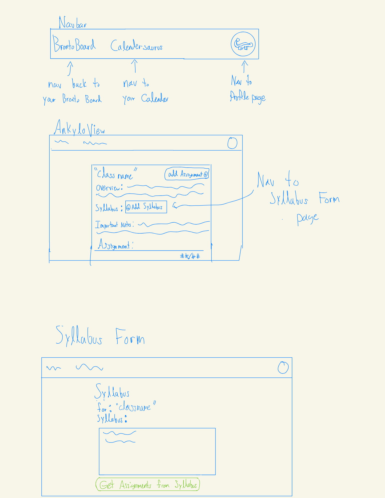

# Assignment 3: An AI-Augmented Concept

## Concept Augmentation

Here I have my original concept for BrontoBoard.  
__concept:__ BrontoBoard  
    __purpose:__ Associates set of Assignments, an overview, office hours, and a name to a class and that class to a BrontoBoard  
    __principle:__ Each Assignment, overview, and Office Hours are associated with One Class. (Does not mean that Assignments, overviews, and office hours must be unique in every class), and each class can only belong to one BrontoBoard  
    __state:__  
    >   - a set of BrontoBoards with  
            - a owner User  
            - a Calendar  
            - a set of Classes with  
                - a name String  
                - an overview String  
                - a set of Assignments  
                - a set of Office Hours  
    __actions:__  
        - __initializeBB__ (user: User, calendar: Calendar): BrontoBoard  
            - __requires:__ A valid user and their calendar  
            - __effects:__ Creates an empty BrontoBoard for the user  
        - __createClass__ ( Classname: String, Overview: String): (class: Class)  
            - __requires:__ the owner is valid and the Classname not be an empty String  
            - __effects:__ Creates a class object assigned to the owner with the given information  
        - __addWork__ (class: Class, workName: String, dueDate: Date): Assignment  
            - __requires:__ owner and class are valid. workName and dueDate be not empty and dueDate be not before the current date  
            - __effects:__  Create an Assignment under the Class of the owner with the given name and due date.  
        -__changeWork:__ (work: Assignment, dueDate: Date):  
            -__requires:__ A valid Assignment of a Class of the owner with a future date.  
            -__effects:__ Modifies the Assignment to the new date  
        -__removeWork:__ (work: Assignment)  
            -__requires:__ A valid owner and existing Assignment  
            -__effects:__ Removes the Assignment from its class  

Here is the concept modified for the llm-feature  
__concept:__ BrontoBoard  
    __purpose:__ Associates set of Assignments, an overview, office hours, and a name to a class and that class to a BrontoBoard  
    __principle:__ Each Assignment, overview, and Office Hours are associated with One Class. (Does not mean that Assignments, overviews, and office hours must be unique in every class), and each class can only belong to one BrontoBoard  
    __state:__  
    >   - a set of BrontoBoards with  
            - a owner User  
            - a Calendar  
            - a set of Classes with  
                - a name String  
                - an overview String  
                - a syllabus String  
                - a set of Assignments  
                - a set of Office Hours  
    __actions:__  
        - __initializeBB__ (user: User, calendar: Calendar): BrontoBoard  
            - __requires:__ A valid user and their calendar  
            - __effects:__ Creates an empty BrontoBoard for the user  
        - __createClass__ ( Classname: String, Overview: String): (class: Class)  
            - __requires:__ the owner is valid and the Classname not be an empty String  
            - __effects:__ Creates a class object assigned to the owner with the given information  
        - __addWork__ (class: Class, workName: String, dueDate: Date): Assignment  
            - __requires:__ owner and class are valid. workName and dueDate be not empty and dueDate be not before the current date  
            - __effects:__  Create an Assignment under the Class of the owner with the given name and due date.  
        -__changeWork:__ (work: Assignment, dueDate: Date):  
            -__requires:__ A valid Assignment of a Class of the owner with a future date.  
            -__effects:__ Modifies the Assignment to the new date
        -__removeWork:__ (work: Assignment)  
            -__requires:__ A valid owner and existing Assignment
            -__effects:__ Removes the Assignment from its class  
        -__addAllWork:__(class: Class, llm: Gemini, syllabus: string)  
            -__requires:__ An existing class in this BrontoBoard and working llm  
            -__effects:__ gathers all important assignments dates in the syllabus and adds them as Assignments  
        -__addSyllabus__(syllabus:string)  
            -__requires:__ A non-empty syllabus  
            -__effects:__ Overwrites the syllabus to the new syllabus  

The main difference was the addition of the last two actions, addAllWork and addSyllabus. addSyllabus sets the stage for addAllWork by adding the syllabus to our data. addAllWork is the direct llm call to obtain all the relevant Assignment information from the syllabus.
  
## User Interaction
  
The user just started their classes, and in advance, signed up for BrontoBoard. However, as the year just started, they do not want to add all their classes at once as it would be a tedious process. In this case, the user would go to the AkyloView of the class they want to add their assignments for and click on a nifty button, called Add Syllabus. With their syllabus of the class, they should be able to view most, if not all, of the important assignment dates. So when they upload the syllabus to the class, they'll see another button called "Add all assignments". If they click this, they'll be sent back to the BrontoBoard and see that the most recent assignments of the class were added, and if they take a closer look in the AkyloView, see that all the assignments were added.  


## Implementation
The implementation of the llm feature was done in [dayplanner.ts](dayplanner.ts) due to working over the given code. I didn't want to mess with the filenames too much since I wanted to focus primarily on the implementation of the actual feature and not worry about debugging the whole system because I didn't rename all the old code. Liekwise, the test cases are written in [dayplanner-tests.ts](dayplanner-tests.ts).

## Validators
The main validators I added to my LLM's response was to check that the name and due date of the Assignment are non empty and integer values for the due date, the due date returned corresponds to a valid date, and if the due date is not a past date. In lines 175 to 185, I check that the name is a non-empty string, and the due date month and day components are both real Integers. Starting at line 189, I run a simple checker that the given date is valid, and at line 194 check that the given date is not a past date. Also, within the prompt I make clear that no extra assignments can be obtained from thin air (no hallucinations).

<!-- # DayPlanner 
A simple day planner. This implementation focuses on the core concept of organizing activities for a single day with both manual and AI-assisted scheduling.

## Concept: DayPlanner

**Purpose**: Help you organize activities for a single day  
**Principle**: You can add activities one at a time, assign them to times, and then observe the completed schedule

### Core State
- **Activities**: Set of activities with title, duration, and optional startTime
- **Assignments**: Set of activity-to-time assignments
- **Time System**: All times in half-hour slots starting at midnight (0 = 12:00 AM, 13 = 6:30 AM)

### Core Actions
- `addActivity(title: string, duration: number): Activity`
- `removeActivity(activity: Activity)`
- `assignActivity(activity: Activity, startTime: number)`
- `unassignActivity(activity: Activity)`
- `requestAssignmentsFromLLM()` - AI-assisted scheduling with hardwired preferences

## Prerequisites

- **Node.js** (version 14 or higher)
- **TypeScript** (will be installed automatically)
- **Google Gemini API Key** (free at [Google AI Studio](https://makersuite.google.com/app/apikey))

## Quick Setup

### 0. Clone the repo locally and navigate to it
```cd intro-gemini-schedule```

### 1. Install Dependencies

```bash
npm install
```

### 2. Add Your API Key

**Why use a template?** The `config.json` file contains your private API key and should never be committed to version control. The template approach lets you:
- Keep the template file in git (safe to share)
- Create your own `config.json` locally (keeps your API key private)
- Easily set up the project on any machine

**Step 1:** Copy the template file:
```bash
cp config.json.template config.json
```

**Step 2:** Edit `config.json` and add your API key:
```json
{
  "apiKey": "YOUR_GEMINI_API_KEY_HERE"
}
```

**To get your API key:**
1. Go to [Google AI Studio](https://makersuite.google.com/app/apikey)
2. Sign in with your Google account
3. Click "Create API Key"
4. Copy the key and paste it into `config.json` (replacing `YOUR_GEMINI_API_KEY_HERE`)

### 3. Run the Application

**Run all test cases:**
```bash
npm start
```

**Run specific test cases:**
```bash
npm run manual    # Manual scheduling only
npm run llm       # LLM-assisted scheduling only
npm run mixed     # Mixed manual + LLM scheduling
```

## File Structure

```
dayplanner/
├── package.json              # Dependencies and scripts
├── tsconfig.json             # TypeScript configuration
├── config.json               # Your Gemini API key
├── dayplanner-types.ts       # Core type definitions
├── dayplanner.ts             # DayPlanner class implementation
├── dayplanner-llm.ts         # LLM integration
├── dayplanner-tests.ts       # Test cases and examples
├── dist/                     # Compiled JavaScript output
└── README.md                 # This file
```

## Test Cases

The application includes three comprehensive test cases:

### 1. Manual Scheduling
Demonstrates adding activities and manually assigning them to time slots:

```typescript
const planner = new DayPlanner();
const breakfast = planner.addActivity('Breakfast', 1); // 30 minutes
planner.assignActivity(breakfast, 14); // 7:00 AM
```

### 2. LLM-Assisted Scheduling
Shows AI-powered scheduling with hardwired preferences:

```typescript
const planner = new DayPlanner();
planner.addActivity('Morning Jog', 2);
planner.addActivity('Math Homework', 4);
await llm.requestAssignmentsFromLLM(planner);
```

### 3. Mixed Scheduling
Combines manual assignments with AI assistance for remaining activities.

## Sample Output

```
📅 Daily Schedule
==================
7:00 AM - Breakfast (30 min)
8:00 AM - Morning Workout (1 hours)
10:00 AM - Study Session (1.5 hours)
1:00 PM - Lunch (30 min)
3:00 PM - Team Meeting (1 hours)
7:00 PM - Dinner (30 min)
9:00 PM - Evening Reading (1 hours)

📋 Unassigned Activities
========================
All activities are assigned!
```

## Key Features

- **Simple State Management**: Activities and assignments stored in memory
- **Flexible Time System**: Half-hour slots from midnight (0-47)
- **Query-Based Display**: Schedule generated on-demand, not stored sorted
- **AI Integration**: Hardwired preferences in LLM prompt (no external hints)
- **Conflict Detection**: Prevents overlapping activities
- **Clean Architecture**: First principles implementation with no legacy code

## LLM Preferences (Hardwired)

The AI uses these built-in preferences:
- Exercise activities: Morning (6:00 AM - 10:00 AM)
- Study/Classes: Focused hours (9:00 AM - 5:00 PM)
- Meals: Regular intervals (breakfast 7-9 AM, lunch 12-1 PM, dinner 6-8 PM)
- Social/Relaxation: Evenings (6:00 PM - 10:00 PM)
- Avoid: Demanding activities after 10:00 PM

## Troubleshooting

### "Could not load config.json"
- Ensure `config.json` exists with your API key
- Check JSON format is correct

### "Error calling Gemini API"
- Verify API key is correct
- Check internet connection
- Ensure API access is enabled in Google AI Studio

### Build Issues
- Use `npm run build` to compile TypeScript
- Check that all dependencies are installed with `npm install`

## Next Steps

Try extending the DayPlanner:
- Add weekly scheduling
- Implement activity categories
- Add location information
- Create a web interface
- Add conflict resolution strategies
- Implement recurring activities

## Resources

- [Google Generative AI Documentation](https://ai.google.dev/docs)
- [TypeScript Documentation](https://www.typescriptlang.org/docs/) -->
